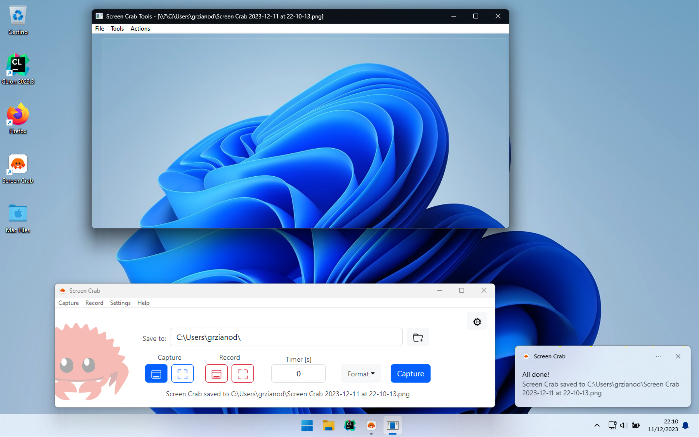
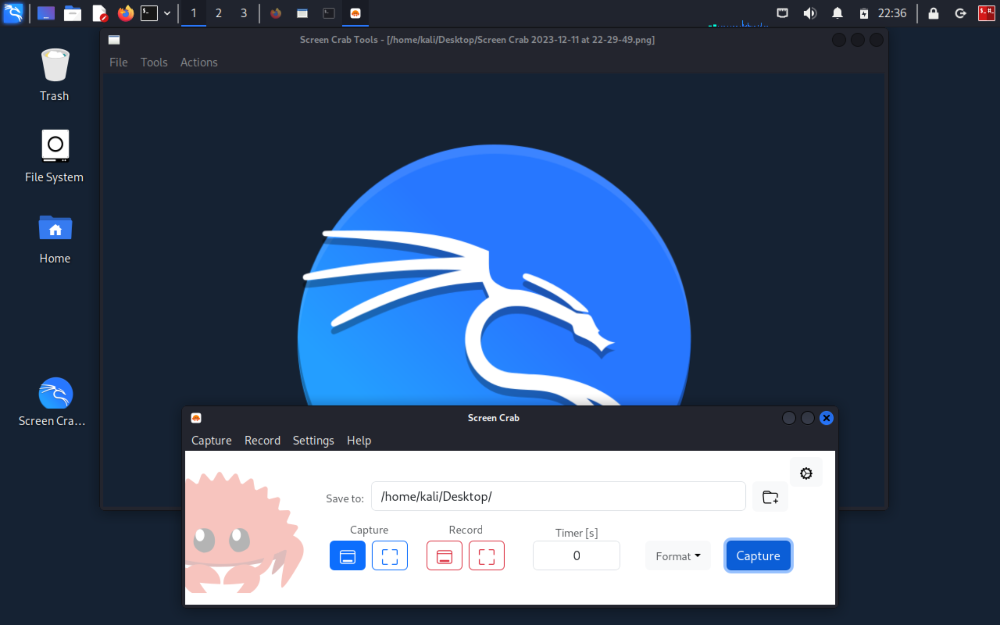

# Screen Crab

A cross-platform screen grabbing utility written in Rust

## Screenshots
- macOS:

    

- Windows:

    

- Debian Linux:

    

## Features

- [x] Cross-Platform Support
- [x] Simple User Interface
- [x] Click&Drag Custom Area Selection
- [x] Custom Hotkeys Support for Fast Capturing
- [x] Multiple Capture and Record Output Formats
- [x] Built-In Annotation Tools
- [x] Delay Timer for Capture and Record
- [x] Custom Save Options and Predefined Naming Convention
- [x] Multi-Monitor Support
- [x] Efficient Screen Recording
- [x] Record Microphone Audio 
