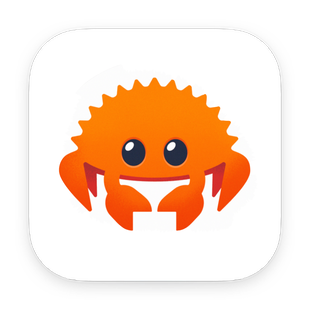
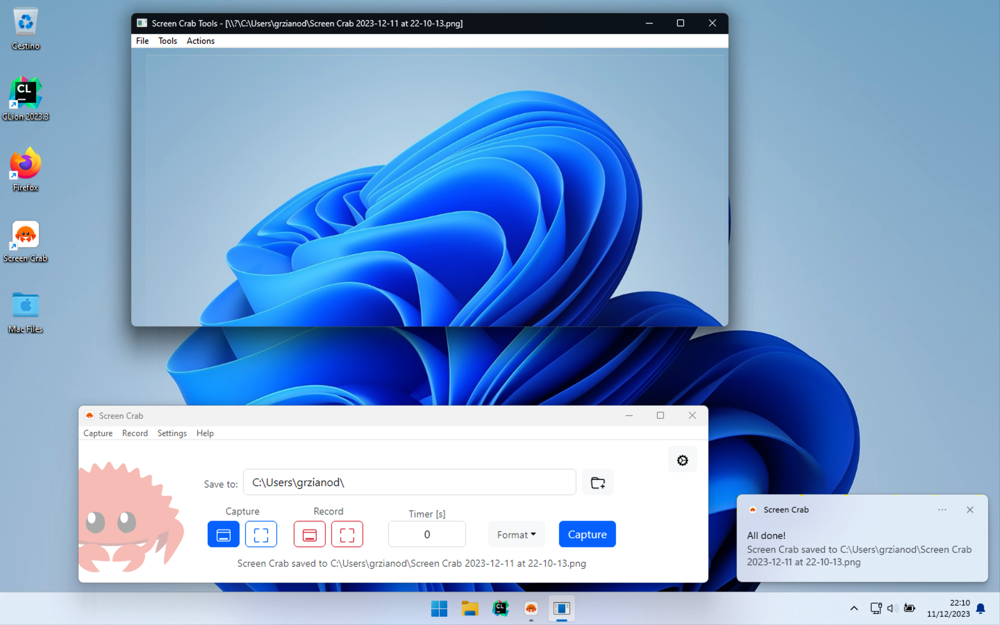
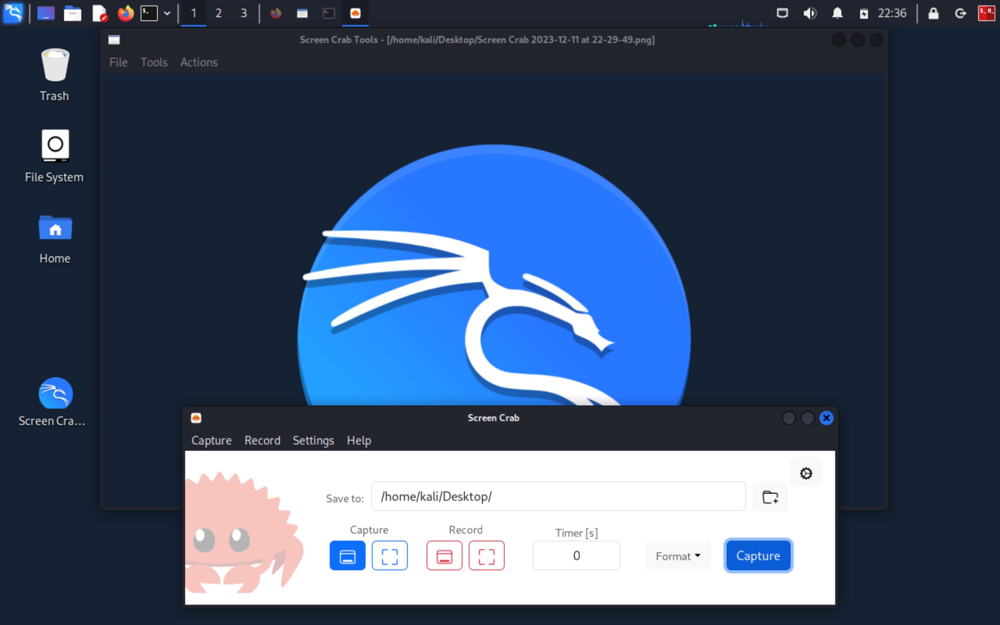

# Screen Crab

A cross-platform Rust application to perform screen grabbing 

## Screenshots
- macOS:

    

- Windows:

    

- Debian Linux:

    

## Features

- [x] Built-In Annotation Tools
- [x] Multi-Monitor support
- [x] Custom Hotkeys support for fast capturing
- [x] Efficient Screen Recording
- [x] Record Microphone Audio 
- [x] Multiple Capture and Record formats
- [x] Delayed Capture and Record
- [x] Click&Drag custom area selection

## Development 

### Recommended Operating Systems
- [Windows 11 Pro](https://www.microsoft.com/it-it/software-download/windows11)
- [Ubuntu 20.04 LTS](https://releases.ubuntu.com/focal/)
- macOS 10.x 

### Setups
- [Windows](setup/windows.ps1)
- [Debian](setup/debian.sh)
- [Darwin](setup/darwin.sh)

### Commands

- `npm run tauri dev`: launches the application in developer mode
- `npm run tauri build`: builds the application for production
