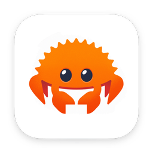

<html>
    <head></head>
    <body>
        

            
            
<strong>Screen Crab</strong>

        

    </body>
</html>

#

A cross-platform Rust application to perform screen grabbing 

### Screenshots
- macOS:

    

### Recommended development Operating Systems
- [Windows 11 Pro](https://www.microsoft.com/it-it/software-download/windows11)
- [Ubuntu 20.04 LTS](https://releases.ubuntu.com/focal/)
- macOS 10.x 

### Setups
- [Windows](setup/windows.ps1)
- [Debian](setup/debian.sh)
- [Darwin](setup/darwin.sh)

### Recommended IDEs Setup

- [CLion](https://www.jetbrains.com/clion/download/) + [Tauri](https://plugins.jetbrains.com/plugin/21659-tauri/versions/stable)
- Visual Studio Code + Tauri plugin

### Commands

- `npm run tauri dev`: launch the application in developer mode
- `npm run tauri build`: builds the application for production
